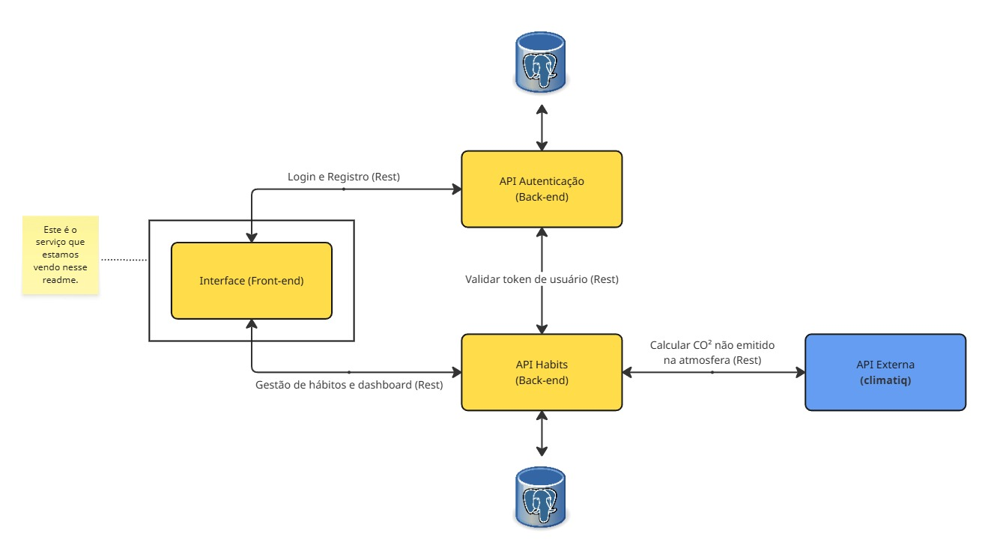

# Sistema de Gestão de Hábitos Sustentáveis - Front-end

## O que o projeto faz (Descrição)

Este projeto é o front-end de uma aplicação de hábitos sustentáveis, permitindo ao usuário cadastrar, visualizar, editar e excluir hábitos, além de acompanhar gráficos e estatísticas de economia de energia e quanto de CO² foi deixado de ser emitido na atmosfera com base nessa economia de kWh. A interface é construída com React e Material UI, integrando-se a um back-end via API REST (Uma API para autenticação e uma para gestão dos hábitos).

### Diagrama
Cada um dos 3 projetos terá o mesmo diagrama, apenas com uma diferença que é a marcação de qual serviço ele representa.



## Pré-requisitos
- Docker e Docker Compose (opcional, para rodar com Docker)
- Aplicação Auth API
- Aplicação Habits API

## Como rodar com Docker

1. Certifique-se de ter o Docker e o Docker Compose instalados.
2. No diretório do projeto, execute o comando abaixo para construir e iniciar o container:

```
docker-compose up --build
```

3. O front-end estará disponível em [http://localhost:3000](http://localhost:3000).

Se precisar parar o container, use:
```
docker-compose down
```

Acesse pela URL [http://localhost:3000](http://localhost:3000) no seu navegador.

Github do projeto: https://github.com/tiagoluizrs/dev-full-stack-puc-bloco3-front-end